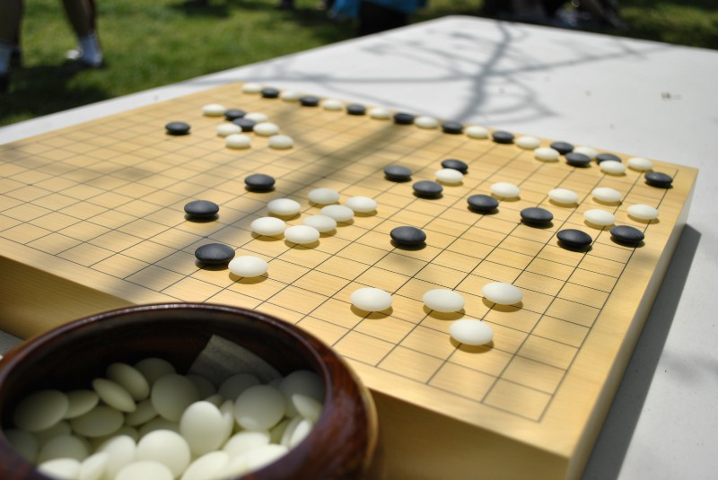
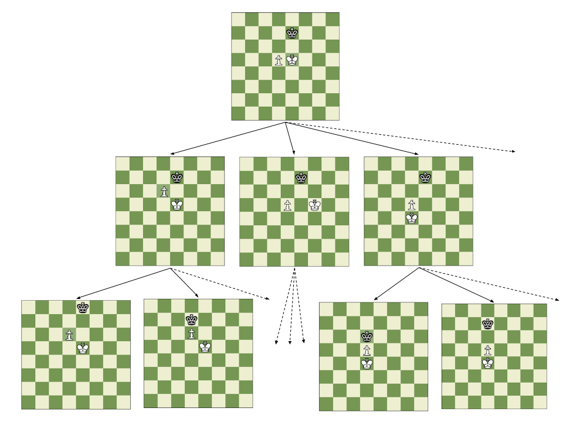
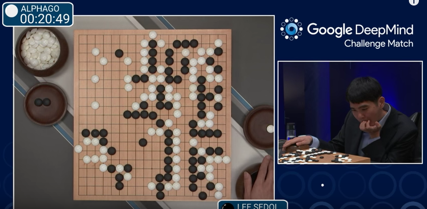

After Lee Sedol — currently the second best ranked Go player in the world — was defeated by Google’s AlphaGo AI last February, there was a roar in the AI community, as it was commonly believed that it would take at least another 10 years for a machine to achieve such a feat.

To get an idea of why this was a common thought among researchers, it may be useful to understand how programs that play chess work (a game where machines have vastly surpassed humans), and then see why the same approach couldn’t be used for the game of Go.

In chess, a procedure known as *minimax* (along with several other clever tricks that help optimize it) is a common strategy to write programs that play the game (a.k.a. chess engines) at a very good level. The most sophisticated of these programs use this approach at their core, including popular open source programs such as GNU Chess and Crafty.

Minimax, which performs what is known in game theory as a “*game tree search*,” can be explained in simple terms as a simulation of the game that takes into account all possible moves of one player and all counter moves of the opponent, until either the end of the game is reached or a certain prefixed number of moves has been simulated (more on this later). In essence, it’s a way of simulating all possible futures of a game, and then figuring out, from the current position, which of the best futures can be forced by the player in turn to get the best possible outcome.

*A partial game tree from a chess ending. Each path from the top level node to the bottom represents a possible game.*

Determining who has an advantage at any given moment (and is therefore more likely to win the game) is another very important component of this approach and, in fact, of basically any approach to building a chess engine. The piece of the engine that does this even has a name: an *evaluation function*. It usually isn’t necessary to evaluate every possible position in a game tree, but only those that appear at the bottom which represent game situations far into the future.

In practice, this simulation approach cannot be carried out for all possibles moves in a game, as mentioned earlier. To see why, consider that the average number of moves at any point in a game of chess is approximately 30. That means that, as we advance in the number of simulated moves, the number of terminal game positions we need to look at grows exponentially fast. For example, a naive approach that looks at every single ending and simulates the game to N number of moves would have to evaluate roughly 30^N positions. An average game in chess lasts about N=80 moves, so this number would amount to the astronomically large 30^80 ~= 10^120!

So, how does a chess engine manage to play the game without considering such a huge number of positions? Well, for starters, rather than evaluating all terminal nodes of a theoretical game tree, most chess engines establish a depth of simulation, which is the maximum number of moves they will simulate for each possible future of the game. This prunes the search space significantly, but requires an evaluation function that can estimate with high accuracy which player would be more likely to win the game if they were to continue playing until the end, assuming perfect play on each side. Some other clever tricks are often used to reduce the number of positions to be evaluated in the simulation. The most common and famous one is called alpha-beta pruning. In the end, however, they all rely on the same basic idea of simulating a game, they just happen to be very clever ways of avoiding the simulation of parts of the search tree that don’t contribute any new information.

*AlphaGo won 4–1 against Lee Sedol in the challenge match where Google offered a 1 million prize*

Back to the reason why AI researchers thought it would take much longer for a Go engine to beat the world champion, the basic reason boils down to the average number of moves that can be done in a given Go position. In chess, this number — known as the *ramification factor* of the game tree — is 30, as I mentioned before, but in Go it is around 300, an order of magnitude bigger, making it completely unfeasible to use the same approach that chess engines use to play a good game, even with all the tricks known to prune the game tree.

Despite its apparent simplicity, Go is actually a more complex game than chess and often requires humans to use their intuition to make the right moves. This posed a very difficult challenge for researchers, who had to turn to other techniques, such as *Monte Carlo tree search* — an approach somewhat similar to minimax, but which relies on randomness and is better suited to deal with the large ramification factor of Go’s game tree and also doesn’t necessarily require an evaluation function as chess engines do — to try and overcome the problem, but their success was quite limited using this approach alone (the best Go engines before AlphaGo only managed to beat amateur players.)

One of the key insight that the team behind AlphaGo had was:
> “What if rather than writing an engine that considers random moves in a Go position using classical Monte Carlo tree search, we could just simulate the game variations that stem from moves that a strong Go player would play in that situation?”

From there, their next step was to figure out a way to do this. Fortunately, the existence of thousands of recorded games between master Go players and the rise of sophisticated machine learning algorithms came to the rescue.

Using that data, they were able to train a couple of deep learning models (convolutional neural networks, or CNNs) that could predict, given a Go position, which moves were most likely to be made by an expert human player. The model was not perfect, but the moves it predicted contained some of the best ones that would be found in a theoretical simulation of the entire game tree, so it was a huge help in pruning the simulation space. A simpler form of this approach had been tried in the past with several other games, but only limited success had been achieved, mostly due to the lack of good data and the right neural network architecture.

They also added a second neural network that acted as an evaluation function and served to limit the depth of simulation, in an attempt to increase the speed with which Monte Carlo tree search converged to an optimal value.

It’s worth noting that the first of these models alone was so powerful that it actually defeated all prior Go engines, but it wasn’t enough to reach the level of professional Go players. To get there, the authors had to figure out a clever combination of those deep learning models and a variation of Monte Carlo tree search that gave AlphaGo the power to defeat one of the best human Go players in a very conclusive manner.

There are other important nitty-gritty details that explain how they managed to make AlphaGo such a good player (*hint: reinforcement learning and self-play*), but that’s probably the topic for another post.

To be fair, the version of AlphaGo that defeated Lee Sedol was a distributed program running on multiple computers and using a large amount of resources, but it’s still impressive that the amount of computing power it needed was much lower than that used by IBM’s DeepBlue in the historical 1996 match against chess world champion Gary Kasparov.

This is a very impressive demonstration of how the combination of multiple techniques in AI (classical search techniques in game trees + supervised machine learning + reinforcement learning) can bring about incredible results that were once thought to be much harder to achieve.

With its ability to learn from others (the supervised training part) and even from itself (the reinforcement learning part), AlphaGo opens up an interesting door into the possibilities of creating complex computer systems that evolve and improve their performance, just as we humans do.
