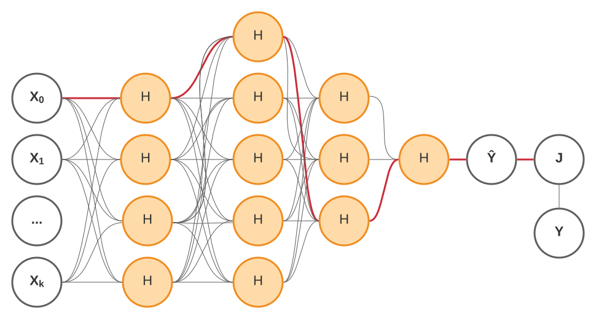
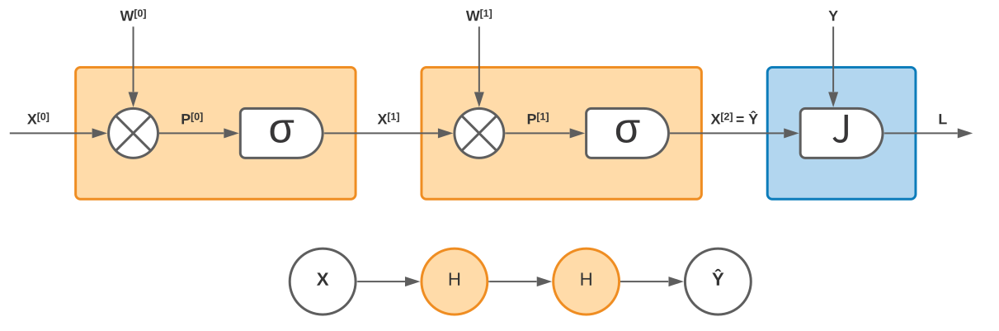
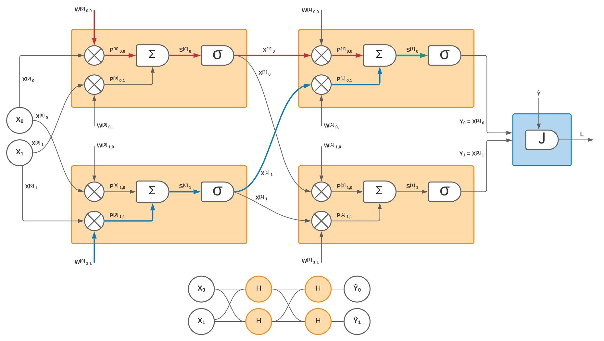

It is often frustrating when I'm trying to learn a new topic and I find a lot of resources but none seem to give me the gist of it. After spending a lot of time researching in various sources, I invariably end up with an "aha" moment when I finally realize that the topic is not really that complex. It is just the way it is presented--with too many details and noise--that make it so hard to digest.

## Neural Networks

When I first learned about neural networks I had this exact problem. Not with the basics of how they work, which I think has been well explained by many people in various places, but rather with the somewhat more complex idea of how they actually learn: _the backpropagation algorithm._

If you're not familiar with neural networks, I strongly suggest you pause here and watch [this excellent introduction](https://www.youtube.com/watch?v=aircAruvnKk) by [Grant Sanderson](https://twitter.com/3blue1brown). He's the author of an amazing [YouTube channel](https://www.youtube.com/channel/UCYO_jab_esuFRV4b17AJtAw) where he explains complex mathematical concepts in very simple ways.

After you're done with that video, you can watch [its continuation](https://www.youtube.com/watch?v=IHZwWFHWa-w) where you will learn about the optimization mechanism (known as _stochastic gradient descent_) used to find the set of parameters (also known as "weights") that will make the network perform as expected.

These videos are somewhat lengthy at 20 minutes each, but I can assure you they're both worth it, and very useful to make sense of the rest of this post if you're not familiar with the basics of neural networks.

## The Gist of Neural Networks
As a recap of the information linked above:

+ A neural network is a universal function approximator. Thus, it can be used as a way to build powerful predictive models.

+ The neural network itself is a function composed of linear parts (i.e., products and sums), and non-linearities (i.e., the activation functions), as is depicted later on in this post.

+ The "knowledge" in a neural network is stored in its parameters $W_{i,j}$ (also known as "weights".)

+ In this setting, learning to perform a task boils down to finding a minima for the cost function $J(W)$, which measures the gap between the network predictions and the expected results. Doing this efficiently is paramount, as it is not uncommon to have networks with hundreds of thousands or even millions of parameters.

+ Since a neural network is a differentiable function, we can use its [gradient](https://en.wikipedia.org/wiki/Gradient) as a compass to guide us in finding one or more minima.

+ Computing the gradient can be a prohibitively expensive operation for most realistic networks if done naively.

+ What the backprogation algorithm does is to organize the computation of the gradient (i.e., the partial derivates of $J(W)$ with respect to each weight $W_{i,j}$) to avoid redundant computation and make the process as efficient as possible. As we'll see later in this post, this can be seen as a form of [dynamic programming](https://zxul767.dev/dynamic-programming/).

The rest of this post will focus mostly on explaining this last point, as it's often one where it's easy to lose sight of the forest for its trees.

## Optimizing the Network
As mentioned earlier, to make the network perform as expected, we need to find a set of weights that minimize the cost function. To accomplish that, we can incrementally update the weights of the network by using the gradient of the cost function (i.e., $ \nabla J(W) $) as a guide for the direction of steepest descent in the n-dimensional "landscape" of the network.

You can imagine this as slowly moving to one of the valleys in the function's "landscape", as is illustrated in the following figure:

<figure>
    
        <figcaption>An illustration of a 3-dimensional "landscape" for the cost function</figcaption>
    </img>
</figure>

### Stochastic Gradient Descent
Computationally speaking, this amounts to repeatedly calculating the following update rule until we hit a point of diminishing returns in the value of the cost function $J(W)$ (i.e., more "training" doesn't lead to any significant improvement in the network's accuracy):

$$
W_{[t+1]} \leftarrow W_{[t]} - \alpha \nabla J(W_{[t]})
$$

where $ W_{[t]} $ represents the weights of the neural network for a given layer at time step $t$; $\alpha$ represents the learning rate (i.e., how big we want each step downhill to be); and $\nabla$ is the gradient operator.

The above equation--written here in vector form--ultimately boils down to computing, for each individual weight $ W_{i,j} $ in the network, the following scalar update rule (we drop the $t$ temporal index for notational convenience):

$$
W_{i,j} \leftarrow W_{i,j} - \alpha \frac{\partial J(W)}{\partial W_{i,j}}
$$

The partial derivative $ \frac{\partial J(W)}{\partial W_{i,j}} $ represents how much influence the weight $ W_{i,j} $ has on the cost function $J(W)$. In other words, if we change the weight by an amount $$ \delta W_{i,j}$$, the partial derivative tells us by how much we can expect $J(W)$ to change (the variables $i$ and $j$ simply refer to the neurons that are connected by a given weighted connection.)

### Computing the Gradient
In principle, we could compute all the partial derivatives independently and solve the problem, but the computation required would soon be prohibitively expensive if we did this naively. To see why, consider the following fully-connected network:

<figure>
    
        <figcaption>
        <strong>X (X0, X1, ...)</strong> is an input vector, <strong>Y</strong> its expected output, <strong>J</strong> is the cost function, and <strong>Ŷ</strong> is the value predicted by the network.
        </figcaption>
    </img>
</figure>

It is somewhat intuitive to see how changing a weight in the first layer will have an effect on the ultimate signal getting to the cost function--not just through the red path shown in the figure, but through all possible such paths--but we still need to pin down the exact details of how this happens.

As a network gets larger in the number of layers and hidden neurons per layer, the number of such possible "influence paths" grows _exponentially_. Analogously, when we "expand" the partial derivative $ \frac{\partial J(W)}{\partial W_{i,j}} $ via the "chain rule", the resulting product contains roughly one term for each of the segments in those paths, thus causing an exponential amount of computation.

But the situation is not insurmountable. As we'll see in a moment, the key insight in the backpropagation algorithm is that there is a lot of redundancy in all of these computations. Even without working out the mathematical details, we can intuit that such redundancy exists, since all paths in the first layers are made up of other subpaths in subsequent layers. If we expand the equation for the partial derivative of any weight, we'll eventually discover a recursive relationship that presents an opportunity for optimization, so long as we organize the computations in a backward fashion, starting with the last layer and finishing at the first (does this remind you of [dynamic programming](https://zxul767.dev/dynamic-programming)?)

To better understand this, let's consider the simplest neural network we can imagine.

### Redundancy in the Gradient Computation
The following diagram depicts the simplest neural network one can imagine, with a single scalar input $X^{[0]}$, two single-neuron hidden layers, and a single scalar output $Ŷ$ that goes into a cost function $J(W)$, which in turn produces a single value $L$ that represents the loss (i.e., the output of the cost function) to be minimized during the training of the neural network.

In the diagram above, we've zoomed in on the atomic operations of the neural network: a product $P^{[0]}$ of the input $X^{[0]}$ and its corresponding weight $W^{[0]}$, and a point-wise activation function denoted by $\sigma$. Notice that we've used a superscript between brackets to denote the layer to which a given quantity corresponds (e.g, $W^{[0]}$ is the weight in the first layer, etc.)

The partial derivative $ \frac{\partial J(W)}{\partial W^{[0]}} $, which represents the influence that $W^{[0]}$ has on the cost function, then looks like:

$$
\frac{\partial J(W)}{\partial W^{[0]}} = \frac{\partial P^{[0]}}{\partial W^{[0]}} \frac{\partial J(W)}{\partial P^{[0]}}
$$

This is just a straightforward application of the [chain rule](https://www.youtube.com/watch?v=H-ybCx8gt-8), but intuitively it expresses the idea that in order to compute the influence of $W^{[0]}$ on the cost function $J(W)$, we can first determine its influence on the intermediate quantity $P^{[0]}$, and then multiply that by the influence of $P^{[0]}$ on $J(W)$. This idea will apply similarly as we expand the equation by considering subsequent blocks in the diagram.

Expanding the second term of the above equation using the same idea, we get:

$$
\frac{\partial J(W)}{\partial W^{[0]}} = \frac{\partial P^{[0]}}{\partial W^{[0]}} \frac{\partial X^{[1]}}{\partial P^{[0]}} \frac{\partial J(W)}{\partial X^{[1]}}
$$

Notice how the above equation simply expresses the influence that subsequent operations have on the cost function, and how that influence propagates via multiplication.

Expanding one more time the last term, we get:

$$
\frac{\partial J(W)}{\partial W^{[0]}} = \frac{\partial P^{[0]}}{\partial W^{[0]}} \frac{\partial X^{[1]}}{\partial P^{[0]}} \frac{\partial P^{[1]}}{\partial X^{[1]}} \textcolor{red}{\frac{\partial J(W)}{\partial P^{[1]}}}
$$

Now let's consider the partial derivative of the cost function with respect to the second weight $W^{[1]}$:

$$
\frac{\partial J(W)}{\partial W^{[1]}} = \frac{\partial P^{[1]}}{\partial W^{[1]}} \textcolor{red}{\frac{\partial J(W)}{\partial P^{[1]}}}
$$

As you can see, the partial derivative highlighted in red in the two previous equations is the same. This is what I meant when I said earlier that we'd eventually find redundancy in the computations. But this is good news because it means that if we compute the partial derivatives in a backward fashion, we'll be able to save a lot of computation by reusing previous results.

## Finding Further Redundancy
You may think that things will get way more complicated once we consider a more general neural network, but that's not really the case. To see why, let's consider the following more general network:

As was the case with the simpler network, we can visually inspect that computing $\textcolor{red}{\frac{\partial J(W)}{\partial W^{[0]}_{0,0}}}$ eventually leads to the computation of $\textcolor{green}{\frac{\partial J(W)}{\partial S^{[1]}_{0}}}$, a computation that is also required by the partial derivative $\textcolor{blue}{\frac{\partial J(W)}{\partial W^{[0]}_{1,1}}}$.

Something similar happens for every weight in each layer, so we can conclude that it is possible to compute all partial derivatives for a given layer ($\frac{\partial J(W)}{\partial W^{[k]}_{i,j}}$) based on an intermediate quantity ($\frac{\partial J(W)}{\partial S^{[k+1]}}$) obtained while computing partial derivatives in the next layer ($\frac{\partial J(W)}{\partial W^{[k+1]}_{i,j}}$). This effectively reduces the computation needed from exponential to something proportional to the number of neurons in the network.

I'll omit the derivations for the general case as it doesn't provide further insight, but if you're curious about the full derivation, you can see the references below.

## Conclusion

Backpropagation is often seen as a complex algorithm, but this apparent complexity is mostly just due to mathematical notation needed to formalize it.

However, if we focus on the underlying ideas, it turns out to be a rather simple and elegant algorithm which embodies the ideas of dynamic programming (i.e., a recursive function that can be efficiently computed by storing intermediate results.)

Once these fundamental ideas are clear, reading articles like [this](https://brilliant.org/wiki/backpropagation) (where the full mathematical derivation is explained in detail) should hopefully be a much easier experience, and no longer something confusing or difficult to grasp.

## Further Reading

+ [Neural Networks](https://www.youtube.com/watch?v=uXt8qF2Zzfo) by [Patrick Winston](https://en.wikipedia.org/wiki/Patrick_Winston). His lecture was a great inspiration for this post, and was also the first material that truly shed light on backprogation for me.

+ [What is backprogation really doing?](https://www.youtube.com/watch?v=Ilg3gGewQ5U) The third video in the series by Grant Sanderson. A very good complement to what was presented in this post.

+ [Neural Networks](https://www.youtube.com/watch?v=Ih5Mr93E-2c) by [Yasser Abu Mostafa](https://work.caltech.edu/) is another great resource that explains, as part of a larger introductory course on machine learning, the derivation of the backprogation algorithm.

+ [Backpropagation](https://brilliant.org/wiki/backpropagation/) by [Brilliant](https://brilliant.org/). After having gotten the gist of backpropagation, this is a great post to read, as it goes into full detail about the mathematical derivations, and even provides a simple implementation in Python in the end.
